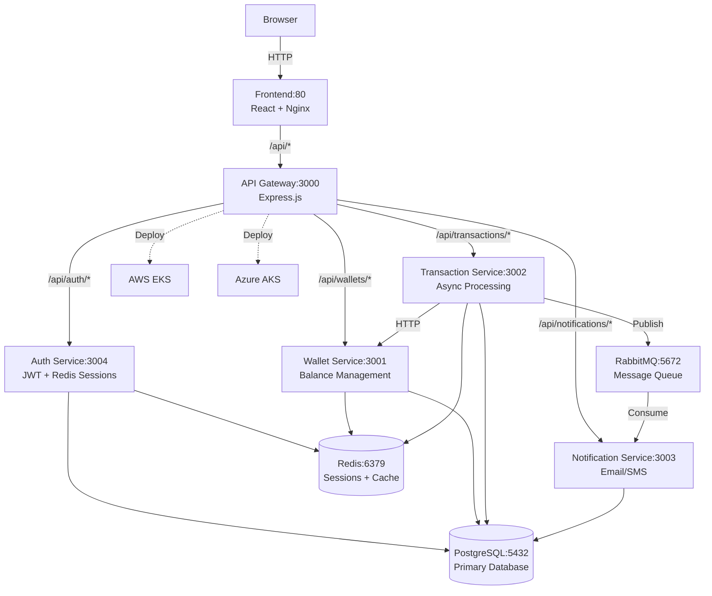

# PayFlow Wallet
> A production-grade fintech microservices platform for digital payments with multi-cloud Kubernetes deployment.

PayFlow Wallet is a complete payment platform demonstrating real-world microservices architecture. It processes money transfers asynchronously, prevents duplicate charges through idempotency, and scales across AWS EKS and Azure AKS. Built with Node.js, PostgreSQL, Redis, and RabbitMQ—the same stack used by Stripe and Square.

## Architecture



## Tech Stack

| Layer | Technology | Purpose |
|-------|-----------|---------|
| **Frontend** | React 18.2.0 | User interface |
| **Web Server** | Nginx | Static files + API proxy |
| **API Gateway** | Express.js 4.18.2 | Request routing, auth, rate limiting |
| **Auth Service** | Express.js 4.18.2 | JWT tokens, bcrypt, Redis sessions |
| **Wallet Service** | Express.js 4.18.2 | Balance management, atomic transfers |
| **Transaction Service** | Express.js 4.18.2 | Async processing, RabbitMQ, circuit breakers |
| **Notification Service** | Express.js 4.18.2 | Email (nodemailer), SMS (Twilio) |
| **Database** | PostgreSQL 15 | ACID transactions, relational data |
| **Cache** | Redis 7 | Sessions, idempotency keys, balance cache |
| **Message Queue** | RabbitMQ 3 | Async processing, retries, DLQ |
| **Containerization** | Docker | Service isolation |
| **Orchestration** | Kubernetes | EKS (AWS), AKS (Azure) |
| **Infrastructure** | Terraform | Multi-cloud provisioning |

## Golden Path — Pick Your Environment

### 🐳 Environment 1: Docker Compose (5 minutes)

Start the full stack locally. No Kubernetes or cloud account needed.

```bash
# 1. Clone
git clone <repo-url> && cd payflow-wallet-2

# 2. Start all services
docker compose up -d

# 3. Wait ~30 seconds for Postgres to init, then validate
./scripts/validate.sh
# → All checks passed — PayFlow is healthy

# 4. Open the app
open http://localhost           # React frontend
# API: http://localhost:3000/health
# RabbitMQ UI: http://localhost:15672  (payflow / payflow123)
```

**With monitoring** (Prometheus + Grafana + Alertmanager):
```bash
docker compose --profile monitoring up -d
open http://localhost:3006      # Grafana  (admin / admin)
open http://localhost:9090      # Prometheus
```

**Teardown:**
```bash
docker compose down -v          # -v removes volumes (clean slate)
```

---

### ☸️ Environment 2: MicroK8s (15–20 minutes)

Production-like Kubernetes on your local machine.

```bash
# 1. Install MicroK8s (macOS via Multipass, Linux via snap)
snap install microk8s --classic                    # Linux
brew install --cask multipass && multipass launch microk8s --name microk8s  # macOS

# 2. Enable required addons
microk8s enable dns ingress storage

# 3. Add /etc/hosts entries
bash scripts/setup-hosts-payflow-local.sh
# Adds: 127.0.0.1  www.payflow.local api.payflow.local

# 4. Deploy
kubectl apply -k k8s/overlays/local

# 5. Wait for pods (all Running/Ready ~2–3 minutes)
kubectl get pods -n payflow -w

# 6. Validate
./scripts/validate.sh --env k8s --host http://api.payflow.local
# → All checks passed — PayFlow is healthy

# 7. Open the app
open http://www.payflow.local
```

**Teardown:**
```bash
kubectl delete namespace payflow
```

---

### ☁️ Environment 3: AWS EKS (45–60 minutes first time)

Full production deployment with RDS, ElastiCache, Amazon MQ.

**Prerequisites:** AWS CLI configured, Terraform ≥ 1.5, `kubectl`, `helm`.

```bash
# 1. Bootstrap Terraform state (one-time)
cd terraform && ./bootstrap.sh --aws-only

# 2. Deploy infrastructure IN ORDER (order matters — see terraform/README.md)
cd aws/hub-vpc          && terraform init && terraform apply -auto-approve
cd ../spoke-vpc-eks     && terraform init && terraform apply -auto-approve
cd ../managed-services  && terraform init && terraform apply -auto-approve
cd ../bastion           && terraform init && terraform apply -auto-approve

# 3. Open bastion tunnel so kubectl can reach the private EKS endpoint
BASTION_IP=$(terraform -chdir=aws/bastion output -raw bastion_public_ip)
EKS_ENDPOINT=$(aws eks describe-cluster --name payflow-eks-cluster --query 'cluster.endpoint' --output text | sed 's|https://||')
ssh -i ~/.ssh/payflow-bastion.pem -L 6443:${EKS_ENDPOINT}:443 ec2-user@${BASTION_IP} -N &

# 4. Configure kubectl
aws eks update-kubeconfig --region us-east-1 --name payflow-eks-cluster

# 5. Install External Secrets Operator (one-time)
helm repo add external-secrets https://charts.external-secrets.io
helm install external-secrets external-secrets/external-secrets \
  -n external-secrets --create-namespace --wait

# 6. Build & push images to ECR via CI
# Push to main branch → GitHub Actions builds and pushes to ECR automatically.
# Get the image tag from the CI summary, then:

# 7. Deploy
IMAGE_TAG=<git-sha-from-ci> ./k8s/overlays/eks/deploy.sh

# 8. Validate
./scripts/validate.sh --env cloud --host https://$(kubectl get ingress -n payflow -o jsonpath='{.items[0].status.loadBalancer.ingress[0].hostname}')
```

---

## What You'll Learn

- **Why database transactions matter** — Atomic debit/credit in PostgreSQL so balances never corrupt on failures.
- **Idempotency keys** — How duplicate requests (retries, double-clicks) are detected and prevented from double-spending.
- **Sync vs async** — HTTP for instant response; RabbitMQ workers for processing and notifications in the background.
- **Kubernetes in production** — How this stack is deployed and kept running on AWS EKS and Azure AKS.

## Deploy to Kubernetes (short form)

```bash
# MicroK8s (local)
kubectl apply -k k8s/overlays/local

# AWS EKS
IMAGE_TAG=<git-sha> ./k8s/overlays/eks/deploy.sh

# Azure AKS
ACR_NAME=<your-acr> IMAGE_TAG=<git-sha> ./k8s/overlays/aks/deploy.sh
```

**First-time infra setup:** See [terraform/README.md](terraform/README.md) for the correct apply order. Run `./terraform/bootstrap.sh --aws-only` to create S3 state bucket, then follow [INFRASTRUCTURE-ONBOARDING.md](INFRASTRUCTURE-ONBOARDING.md).

## Docs

| Document | What's in it |
|----------|-------------|
| [TROUBLESHOOTING.md](TROUBLESHOOTING.md) | **Start here when something breaks** — every failure, root cause, and fix |
| [Infrastructure & Deployment Guide](docs/INFRASTRUCTURE-AND-DEPLOYMENT-GUIDE.md) | Full AWS EKS guide — spinup, ECR, deploy.sh, bastion SSM/kubectl |
| [Infrastructure onboarding](INFRASTRUCTURE-ONBOARDING.md) | Ordered checklist (bootstrap → Hub → EKS → managed services → bastion → app) |
| [Quick start infra](QUICK-START-INFRA.md) | Full step-by-step with Terraform targets, verification, troubleshooting |
| [Services](docs/SERVICES.md) | Every endpoint, port, env var, message queue details |
| [Architecture](docs/ARCHITECTURE.md) | Request flow, data model, infrastructure diagrams |
| [Deployment Order](docs/DEPLOYMENT-ORDER.md) | Prerequisites, step-by-step with Terraform targets |
| [Deploy & Rollback](docs/DEPLOYMENT.md) | Local → K8s → Terraform, database migrations, rollback procedures |
| [Runbook](docs/RUNBOOK.md) | Debug issues, monitor health, fix common problems |
| [Local setup gotchas](docs/LOCAL-SETUP-GOTCHAS.md) | Port conflicts, Apple Silicon, Windows/WSL2 |

**Having issues?** Start with [TROUBLESHOOTING.md](TROUBLESHOOTING.md) — every known failure with root cause and fix. For local dev problems (ports, ARM, WSL): [Local setup gotchas](docs/LOCAL-SETUP-GOTCHAS.md). For deeper debugging: [Runbook](docs/RUNBOOK.md).

## Key Features

- **JWT Authentication** - Access tokens with Redis-backed refresh tokens and token blacklisting
- **Async Transaction Processing** - RabbitMQ queues work, workers process in background, users get instant feedback
- **Idempotent Transactions** - Redis at API Gateway + database checks at worker level prevent duplicate charges
- **Atomic Money Transfers** - PostgreSQL transactions with row locking ensure balances never corrupt
- **Circuit Breakers** - Prevents cascading failures when services are down
- **Multi-Cloud Ready** - Deploys to AWS EKS and Azure AKS with Terraform
- **Production Monitoring** - Prometheus metrics, Grafana dashboards, structured logging
