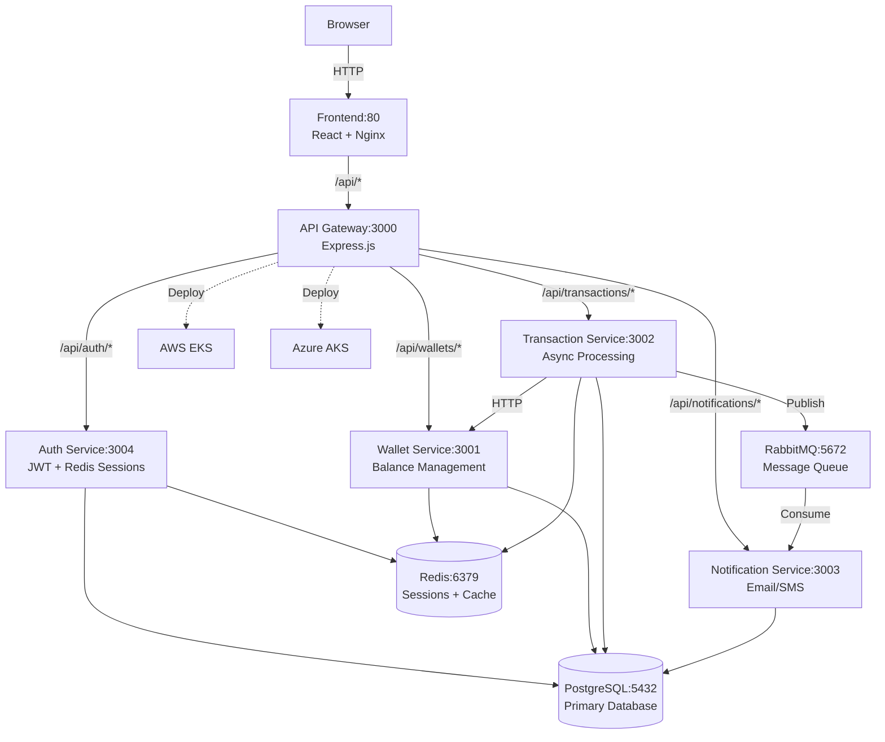

# PayFlow Wallet


> A production-grade fintech microservices platform for digital payments with multi-cloud Kubernetes deployment.

PayFlow Wallet is a complete payment platform demonstrating real-world microservices architecture. It processes money transfers asynchronously, prevents duplicate charges through idempotency, and scales across AWS EKS and Azure AKS. Built with Node.js, PostgreSQL, Redis, and RabbitMQ—the same stack used by Stripe and Square.

> **New here? → [`LEARNING-PATH.md`](LEARNING-PATH.md)**
> Week-by-week curriculum: run the app → break it → understand the architecture → deploy to cloud.
> Start there. Everything else in this README is reference material.
> **Overwhelmed?** Open that file and read **“If you feel lost or overloaded”** at the top—three links, one focus.

**Deep dive (design choices, fintech mindset, end-to-end traces):** [*Building PayFlow* — a developer’s field guide](https://osomudeya.gumroad.com/l/payflow) walks through why the system is built the way it is (atomicity, idempotency, queues vs HTTP, Terraform/Kubernetes, security, observability, CI/CD). It complements this repo’s markdown docs; when something disagrees, **the repo and running code are the source of truth**.

**Credit:** If you use this repo as a base for your own project, course, or content, please **acknowledge PayFlow Wallet** and link to [https://github.com/Ship-With-Zee/payflow-wallet](https://github.com/Ship-With-Zee/payflow-wallet). See [`CONTRIBUTING.md`](CONTRIBUTING.md) for contribution guidelines and attribution details.

## Architecture



*EKS hub-and-spoke pipeline (higher resolution and related figures: [docs/architecture.md](docs/architecture.md)).*


## Tech Stack

| Layer | Technology | Purpose |
|-------|-----------|---------|
| **Frontend** | React 18.2.0 | User interface |
| **Web Server** | Nginx | Static files + API proxy |
| **API Gateway** | Express.js 4.18.2 | Request routing, auth, rate limiting |
| **Auth Service** | Express.js 4.18.2 | JWT tokens, bcrypt, Redis sessions |
| **Wallet Service** | Express.js 4.18.2 | Balance management, atomic transfers |
| **Transaction Service** | Express.js 4.18.2 | Async processing, RabbitMQ, circuit breakers |
| **Notification Service** | Express.js 4.18.2 | Email (nodemailer), SMS (Twilio) |
| **Database** | PostgreSQL 15 | ACID transactions, relational data |
| **Cache** | Redis 7 | Sessions, idempotency keys, balance cache |
| **Message Queue** | RabbitMQ 3 | Async processing, retries, DLQ |
| **Containerization** | Docker | Service isolation |
| **Orchestration** | Kubernetes | EKS (AWS), AKS (Azure) |
| **Infrastructure** | Terraform | Multi-cloud provisioning |

## Golden Path — Pick Your Environment

**Recommended for [`LEARNING-PATH.md`](LEARNING-PATH.md):** start with **MicroK8s** (Environment 1) so Week 1 matches real Kubernetes. Use **Docker Compose** (Environment 2) if you want the fastest smoke test without a cluster.

### ☸️ Environment 1: MicroK8s (15–20 minutes) — recommended for learners

Production-like Kubernetes on your machine—the same shape as cloud, without AWS cost.

From the repo root, run **`./scripts/deploy-microk8s.sh`**. It installs or uses MicroK8s, enables addons (registry, ingress, etc.), optionally builds and loads images, applies `k8s/overlays/local`, and prints access hints. Requires **Docker**. **macOS:** **Multipass** too. **Linux:** snap-based MicroK8s on the host (single-node; workers not auto-provisioned). **Windows:** use **WSL2** + Linux — native Windows shells are not supported by this script. Details: [`docs/microk8s-deployment.md`](docs/microk8s-deployment.md).

**After deploy:** add hosts, validate, open the app:

```bash
bash scripts/setup-hosts-payflow-local.sh   # 127.0.0.1  www.payflow.local api.payflow.local
export KUBECONFIG="${HOME}/.kube/microk8s-config"   # if deploy script printed this
./scripts/validate.sh --env k8s --host http://api.payflow.local
open http://www.payflow.local
```

**Manual MicroK8s:** `microk8s enable dns storage registry ingress metrics-server`, kubeconfig, then `kubectl apply -k k8s/overlays/local`—see [`docs/microk8s-deployment.md`](docs/microk8s-deployment.md).

**Optional — GitOps on the laptop:** [`docs/cicd-local.md`](docs/cicd-local.md) (`.github/workflows/gitops-local.yml`).

**Teardown:**
```bash
kubectl delete namespace payflow
```

---

### 🐳 Environment 2: Docker Compose (~5 minutes) — optional, no Kubernetes

Fastest way to see the UI and API on **`http://localhost`** when you cannot or do not want MicroK8s yet (still covered in Week 1 optional block in the learning path).

```bash
git clone https://github.com/<your-username>/payflow-wallet-2.git && cd payflow-wallet-2
docker compose up -d
# Wait ~30 seconds for Postgres, then:
./scripts/validate.sh
open http://localhost
# API: http://localhost:3000/health — RabbitMQ UI: http://localhost:15672 (payflow / payflow123)
```

**Monitoring profile** (Prometheus + Grafana + Alertmanager)—great for the learning path “minimal triad”:

```bash
docker compose --profile monitoring up -d
open http://localhost:3006      # Grafana (admin / admin)
open http://localhost:9090      # Prometheus
```

**Teardown:**
```bash
docker compose down -v
```

---

### ☁️ Environment 3: AWS EKS (first time ~45–90 minutes)

Full production deployment with RDS, ElastiCache, Amazon MQ.

**Prerequisites:** AWS CLI configured, Terraform ≥ 1.5, `kubectl`, `helm`.

**Infrastructure — pick one:**

- **Scripted:** From the repo root, run **`./spinup.sh`**, choose **aws** and your workspace (**dev** / **prod**). It bootstraps remote state (S3 + DynamoDB), then applies Hub VPC → EKS spoke → managed services → bastion → FinOps in order. When it prints *Spin-up complete*, continue with the steps below (bastion tunnel through deploy).
- **Manual Terraform:** run the module sequence yourself (same order as `spinup.sh`):

```bash
# 1. Bootstrap Terraform state (one-time)
cd terraform && ./bootstrap.sh --aws-only

# 2. Deploy infrastructure IN ORDER (order matters — see terraform/README.md)
cd aws/hub-vpc          && terraform init && terraform apply -auto-approve
cd ../spoke-vpc-eks     && terraform init && terraform apply -auto-approve
cd ../managed-services  && terraform init && terraform apply -auto-approve
cd ../bastion           && terraform init && terraform apply -auto-approve
```

**After infrastructure (both options):**

```bash
# 3. Open bastion tunnel so kubectl can reach the private EKS endpoint (from repo root)
BASTION_IP=$(terraform -chdir=terraform/aws/bastion output -raw bastion_public_ip)
EKS_ENDPOINT=$(aws eks describe-cluster --name payflow-eks-cluster --query 'cluster.endpoint' --output text | sed 's|https://||')
ssh -i ~/.ssh/payflow-bastion.pem -L 6443:${EKS_ENDPOINT}:443 ec2-user@${BASTION_IP} -N &

# 4. Configure kubectl
aws eks update-kubeconfig --region us-east-1 --name payflow-eks-cluster

# 5. Install External Secrets Operator (one-time)
helm repo add external-secrets https://charts.external-secrets.io
helm install external-secrets external-secrets/external-secrets \
  -n external-secrets --create-namespace --wait

# 6. Build & push images to ECR via CI
# Push to main branch → GitHub Actions builds and pushes to ECR automatically.
# Get the image tag from the CI summary, then:

# 7. Deploy (from repo root)
IMAGE_TAG=<git-sha-from-ci> ./k8s/overlays/eks/deploy.sh

# 8. Validate
./scripts/validate.sh --env cloud --host https://$(kubectl get ingress -n payflow -o jsonpath='{.items[0].status.loadBalancer.ingress[0].hostname}')
```

`./spinup.sh` can also target **Azure (AKS)** if you choose `aks` at the prompt; use the AKS deploy path in the short form below when deploying the app.

---

## What You'll Learn

- **Why database transactions matter** — Atomic debit/credit in PostgreSQL so balances never corrupt on failures.
- **Idempotency keys** — How duplicate requests (retries, double-clicks) are detected and prevented from double-spending.
- **Sync vs async** — HTTP for instant response; RabbitMQ workers for processing and notifications in the background.
- **Kubernetes locally then in production** — MicroK8s first in [`LEARNING-PATH.md`](LEARNING-PATH.md), then EKS/AKS with Terraform and the same manifests.

## Deploy to Kubernetes (short form)

```bash
# MicroK8s (local) — recommended: ./scripts/deploy-microk8s.sh
kubectl apply -k k8s/overlays/local

# AWS EKS (after ./spinup.sh or manual Terraform + bastion + ESO)
IMAGE_TAG=<git-sha> ./k8s/overlays/eks/deploy.sh

# Azure AKS
ACR_NAME=<your-acr> IMAGE_TAG=<git-sha> ./k8s/overlays/aks/deploy.sh
```

**First-time infra setup:** Run **`./spinup.sh`** (AWS or AKS) from the repo root, or see [terraform/README.md](terraform/README.md) / [Infrastructure onboarding](docs/INFRASTRUCTURE-ONBOARDING.md) for the manual apply order.

## Docs

| Document | What's in it |
|----------|-------------|
| **[Contributing & attribution](CONTRIBUTING.md)** | How to contribute; **please give credit** if you reuse this project |
| **[Documentation index](docs/README.md)** | **Start here** — maps every major doc (run, AWS deploy, debug, learn) and marks canonical paths |
| [LEARNING-PATH.md](LEARNING-PATH.md) | Week-by-week curriculum |
| [TROUBLESHOOTING.md](TROUBLESHOOTING.md) | Quick symptom → root cause → fix |
| [Services](docs/SERVICES.md) | Endpoints, ports, env vars, queues |
| [Architecture](docs/architecture.md) | Request flow, data model, diagrams |
| [MicroK8s](docs/microk8s-deployment.md) | Local Kubernetes deploy and troubleshooting |
| [Local CI/CD](docs/cicd-local.md) | Self-hosted runner + MicroK8s registry + Argo CD |
| [Home lab drills](docs/HOME-LAB-DRILLS.md) | Hands-on break/fix exercises |

**AWS EKS / Terraform:** Follow the order in [docs/README.md](docs/README.md) (onboarding → deployment order → optional quick start). **Having issues?** [TROUBLESHOOTING.md](TROUBLESHOOTING.md), then [docs/troubleshooting.md](docs/troubleshooting.md) for depth. **Local quirks:** [docs/LOCAL-SETUP-GOTCHAS.md](docs/LOCAL-SETUP-GOTCHAS.md). **Ops:** [docs/RUNBOOK.md](docs/RUNBOOK.md).

## Key Features

- **JWT Authentication** - Access tokens with Redis-backed refresh tokens and token blacklisting
- **Async Transaction Processing** - RabbitMQ queues work, workers process in background, users get instant feedback
- **Idempotent Transactions** - Redis at API Gateway + database checks at worker level prevent duplicate charges
- **Atomic Money Transfers** - PostgreSQL transactions with row locking ensure balances never corrupt
- **Circuit Breakers** - Prevents cascading failures when services are down
- **Multi-Cloud Ready** - Deploys to AWS EKS and Azure AKS with Terraform
- **Production Monitoring** - Prometheus metrics, Grafana dashboards, structured logging
